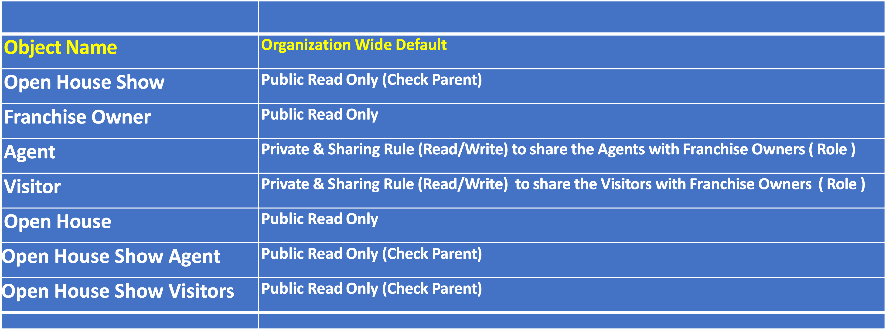
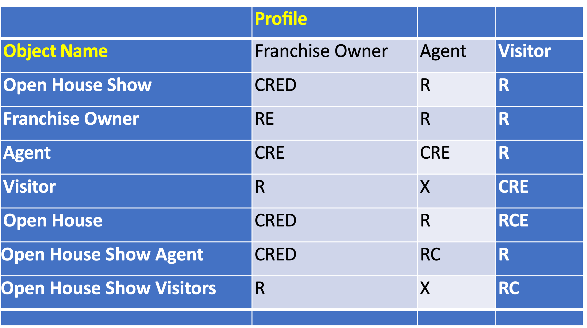

# Handson Deveoper Project for Clarusway Salesforce Bootcamp Cohort-3 Students : Open House Show App for New Again Houses LLC

## Description

New Again Houses® was born in Bristol in 2008 with one simple mission: to solve real estate problems. That mission has grown and evolved throughout the years, and now we serve homeowners not only in the Tri Cities area, but all across the country. 

https://newagainhouses.com/

New Again Houses was has recently implemented Salesforce with Triforcia and they are very happy with the service provided. Kudos to you since you were the hereos of the existing projet!

They have additional requirements to implement on Salesforce

## Problem Statement

New Again Houses needs an open house management software 

which will help them to manage their open houses effectively along with
 
- franchise owner,

- customer, 

- open house address, 

- and time information. 

After many hours of meetings, the following plan has been prepared.

## Objects to Create

**Open House**

Open House Name ( Standard field ) 

- Street*

- City*

- State*

- Postal code

- Country*

- Google Maps Link

- Is Active (Checkbox)

**Open House Show**

- Open House Show Name ( Standard field ) 

- Open House (MD Open House)

- Show Date*

- Start Time*

- End Time*

- Max Number of  Visitors 

- Actual Number of Visitors

- Remaining Number Visitors 

- Open House is Active (Formula Open House - Is Active field)

- Show Type (Virtual, Physical)

- Is Live Show(Checkbox)

- Address

- Is Published (Checkbox)

**Franchise Owner**

- Full Name ( Standard field ) 

- City

- State

- Postal code

- Country

- Email*

- Phone

- Franchisee since

- Is Active?

**Visitor**

- Full Name( Standard field ) 

- Email*

- Phone

**Agent**

- Full Name ( Standard field ) 

- Email*

- Phone

- Working with Franchise (Lookup Franchise Owner)

**Open House Show Agent**

- Open House Show (MD Open House Show)

- Agent(MD Agent)

**Open House Show Visitors**

- Open House Show (MD Open House Show)

- Visitor(MD Visitor)

- Google Maps Link**

- Street**

- City**

- State**

- Postal code**

- Country**

- Email**

*Required fields

** Hide from Page Layout

##Data Modeling

## Organization Wide Defaults

Note: This is the initial plan. If you think that an update needed, please feel free to change. But please test it first!

## Profile/Permission Set Settings

C - Create

R - Read

E - Edit

D - Delete

X - No Access 

*Permission Set recommended
Note: This is the initial plan. If you think that an update needed, please feel free to change. But please test it first!

## Email Template to Visitors

Subject : Your Invitation successfully created

Email Body : 

Dear {Visitor Name},

Thank you for registering for {Open House Show Name} which will be available on { Open House Show Date} between { Open House Show Start Time}  and { Open House Show End Time} at {Open House Address}. 

We are excited to have you, see you in the show.

Find the Google Map Location for the Open House here: {Open House Google Map Link}

Thanks,
{Organization Name}

## Unit Test Classes

At-least 75% code coverage. Try to achieve 95%

Create TestUtility Class 

Create mock data method in the test class

Use Test.startTest & Test.stopTest

Cover all possible scenarios (Test coverage is not the only criteria)

## Unmanaged Package

Please create all objects and fields yourself. 

But if you would like to skip this step, you can install the package (not recommended), please use the link below: 

[Install Unmanaged App Package](https://login.salesforce.com/packaging/installPackage.apexp?p0=04tDm0000004urp&isdtp=p1)

Install for Admin only recommended.

##Tasks

[New Again House -  Open House Show App Tasks (Excel File)](NewAgainHousesIssues.xlsx)

## At the end of the project, following topics are to be covered;

- Apex Coding

- Test Classes

- Triggers

- Batch Apex

- Scheduled Apex

- Lightning Web Components

- Security of Production org

- Flow

- Experience Cloud

- Project Management

- Jira Projecect Management Tool

- Git & Github for Version Control System

- VS Code Usage

### At the end of the project, students will be able to;

- Design and implement custom objects and fields in Salesforce

- Develop Apex code and test classes to support business requirements

- Create triggers to automate processes and enforce business rules

- Implement batch and scheduled Apex to process data in bulk or at specified times

- Develop Lightning Web Components (LWC) to provide modern user interfaces

- Create screen flows to guide users through complex processes

- Understand and apply Salesforce security features to ensure data privacy and prevent unauthorized access

- Utilize Salesforce Flow to automate and streamline business processes

- Configure and customize Experience Cloud to provide a branded, self-service portal for customers
 
- Manage a project using Jira project management tool and Git & Github for version control system

## Steps to Solution
  
- Step 1: Download or clone project definition from `Clarusway_Cohort3_Developer_Handson` repo on Github 

- Step 2: Create project folder for local public repo on your pc

- Step 3: Install unmanaged package to your developer org 

- Step 4: Complete Administrator implementation tasks  

- Step 5: Write LWC components, Apex triggers, and classes on the VS Code

- Step 6: Create Screen flow alternatives for each LWC component if available 

- Step 7: Deploy your application on developer org using to showcase your app within your team.

- Step 8: Prepeare your presentation on 17th March 2023 at 8 PM

## Considerations

- Feel free to update fields, page layouts, and settings

- Use brand new, never touched developer org(not playground)

## Resources

- [Developer Org Signup](https://developer.salesforce.com/signup)

- [Apex Developer Guide](https://developer.salesforce.com/docs/atlas.en-us.apexcode.meta/apexcode/apex_dev_guide.htm)

- [Lightning Design System](https://www.lightningdesignsystem.com/)

- [Lightning Component Library](https://developer.salesforce.com/docs/component-library/overview/components)

- [Presentation for the Project(PDF)](NewAgainHousesDeveoperProject.pdf)

